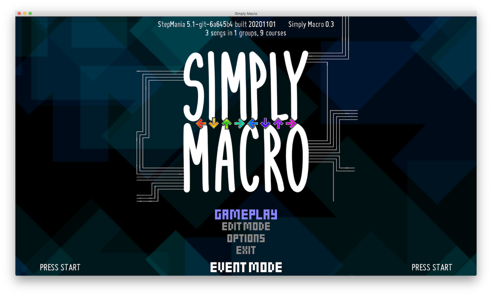

Simply Macro is a fork of Simply Love for SM5 with different global offsets to account for different simfile offset standards, as well as a DDR timing mode via MochitheDog.

* [Why?](#why)
* [Quick setup guide](#quick-setup-guide)
* [Implemented features/changes](#implemented-featureschanges)
* [Potential features/changes](#potential-featureschanges)
* [How are the different offsets implemented?](#how-are-the-different-offsets-implemented)
* [How do I set DDROffset manually?](#how-do-i-set-ddroffset-manually)
* [Why did you disable Decents and WayOffs by default?](#why-did-you-disable-decents-and-wayoffs-by-default)
* [What do you get with DDR game mode?](#what-do-you-get-with-ddr-game-mode)
* [Other limitations](#other-limitations)
* [Acknowledgements](#acknowledgements)
* [Closing time](#closing-time)

## Why?
Step artists/simfile creators sync songs differently. Many sync to a null offset, whereas others sync to account for play on an ITG dedicab (+9 ms). Our primary objective here is to allow for play of both kinds of simfiles and songs without worrying about conforming every song to a single offset standard or using multiple StepMania setups. To accomplish this, Simply Macro sets StepMania's global offset each time you choose a song, based on a configurable list of "ITG" song groups.

## Quick setup guide
1. Make sure your GlobalOffsetSeconds is accurate for null offset-synced songs (i.e., songs not synced to account for ITG's +9 ms)
2. Install Simply Macro by dropping the folder in [your SM folder]/Themes/
3. Edit Simply-Macro/Other/ITG-Sync-Groups.txt to include song groups that are ITG-synced, while excluding any song groups that are instead synced to a null offset
4. Switch the game's active theme to Simply Macro
5. Enable the "DDR Offset" setting in "Simply Macro Options" in-game if that's what you're here for
5. ???
6. Profit!

## Implemented features/changes
- [x] Different global offsets for "ITG" groups vs. non-"ITG" groups
- [x] DDR Offset is adjustable in-game (and can also be disabled) in "Simply Macro Options"
- [x] Enable/disable Decents and WayOffs by default (disabled by default)
- [x] [MochitheDog's DDR game mode](https://github.com/MochitheDog/Simply-Love-SM5) for Simply Love
- [x] Enable/disable showing judgments under, rather than above, arrows
- [x] Enable/disable the GrooveStats QR code pane shown on the evaluation screen
- [x] A shiny Simply Macro title screen, plus other visual tweaks
- [x] New music for the select color/game mode screens in the default Macro (マ) visual style

## Potential features/changes
- [ ] Enable user-configurable custom global offset for a separate list of song groups
- [ ] Automatically switch GlobalOffsetSeconds back to the DDR Offset (if it isn't already) when switching to a different theme
- [ ] Alternative rainbow/color mode preferences
- [ ] Fancier title screen/revamped attract loop
- [ ] DDR-specific judgment graphics that match Wendy and/or are similar to Love
- [ ] Merge bug fixes/changes from upstream Simply Love 4.9.1

## How are the different offsets implemented?
This fork uses a new theme preference called DDROffset. DDROffset should be the same as what GlobalOffsetSeconds should be if you've properly synced your pads to play songs with a null offset—except in milliseconds, rather than in seconds. The first time you use Simply Macro, the game will set your DDROffset as whatever GlobalOffsetSeconds is, multiplied by 1,000.

When you select a song, the game checks Simply-Macro/Other/ITG-Sync-Groups.txt for a list of groups that are synced to the ITG +9 ms standard. If the song you've selected belongs to one of those groups, the game will set GlobalOffsetSeconds to the value of DDROffset, divided by 1,000, minus 0.009. If the song is not in one of those groups, the game will set GlobalOffsetSeconds to the value of DDROffset times 1,000.

## How do I set DDROffset manually?
You can set DDROffset in the new Simply Macro Options menu in-game. After you run the game with Simply Macro for the first time, you'll also be able to find DDROffset as a preference in ThemePrefs.ini. As mentioned above, if the game does not detect a value for DDROffset, it will use the current value of GlobalOffsetSeconds to set DDROffset. (DDROffset gets rounded to the nearest millisecond.)

**CAUTION: Any adjustments you make to GlobalOffsetSeconds by editing Preferences.ini will be overridden whenever you select a song in this theme.** Likewise, if you use AutoSync or otherwise adjust GlobalOffsetSeconds in the game, the changed GlobalOffsetSeconds value will get overridden based on DDROffset the next time you select a song.

You may thus want to make note of any AutoSync-suggested change to manually edit DDROffset. Alternatively, switch to vanilla Simply Love, use AutoSync with a song you know is synced to a null offset, exit the game, and delete DDROffset from ThemePrefs.ini before starting the game (and switching back to Simply Macro) again.

All of this can be a bit tricky, so I highly recommend figuring out what your DDROffset (i.e., GlobalOffsetSeconds for a null offset-synced song) should be before using this theme for the first time. And if you want to switch back to using vanilla Simply Love or another theme as your "daily driver," make sure that your GlobalOffsetSeconds is properly set when you do so.

## Why did you disable Decents and WayOffs by default?
In the past several years of playing DDR A, I've gotten used to ghost-stepping in a way that often triggers Decents and WayOffs on ITG, so I now almost always turn off "The Boys." I find the game much more enjoyable without them. Vanilla Simply Love resets the relevant setting every time you start a new game session, and I would prefer not having to do that. Thus, I've disabled them by default, although I've now also included an option to re-enable them by default.

## What do you get with DDR game mode?
- Selectable DDR mode at game start enables DDR-approximate timing windows as follows (in seconds):
  - Marvelous: 0.016667,
  - Perfect: 0.033333,
  - Great: 0.091667,
  - Good: 0.141667,
  - Boo (disabled by default): 0.225000
- Judgments are renamed from ITG names to DDR names as seen above.
- "Goods" count towards combo.
- Scores earned in DDR mode are saved to a separate .xml file.

Note: Life mechanics in DDR mode have *not* been changed from Simply Love's ITG settings. Scoring is also percentage-based as it is in vanilla Simply Love/ITG.

  
Click to see screenshots of DDR game mode.

## Other limitations
- I've only tested this on StepMania 5.0.12 and StepMania 5.1-new.
- Bug fixes from [Simply Love 4.9.1](https://github.com/quietly-turning/Simply-Love-SM5/releases/tag/4.9.1) have not been merged into this fork yet, so there are a few bugs out there.
- Any changes I've made have only been in English, so switching to another language will leave Simply Macro additions untranslated.

## Acknowledgements
- Special thanks to quietly-turning for creating, maintaining, and adding new features to [Simply Love for SM5](https://github.com/quietly-turning/Simply-Love-SM5). Simply Love is stable, functional, easy-to-use, and aesthetically consistent; it is a beautifully simple theme. No one should take this for granted. Finally, thank you also for documenting the code well for people like me to tweak it easily.
- Thanks to MochitheDog for implementing the DDR game mode and [sharing it with the world](https://github.com/MochitheDog/Simply-Love-SM5).
- Additional judgment graphics by zenius-i-vanisher user bLOOdSAW/HURG: https://zenius-i-vanisher.com/v5.2/thread?threadid=8936&page=1

## Closing time
This fork is primarily meant to be useful for myself. Still, as I continue working on this, I'm open to ideas, suggestions, bug reports, or anything, really. And please forgive any issues. This is the first time I've used git or GitHub, the first time I've made any edit to a StepMania theme, and the first time I've done anything in Lua. In any case, I hope this is useful for some of you. Thanks for checking this out, and stay cool!
—13wonders (*last updated 11/01/2020* for version 0.3)
